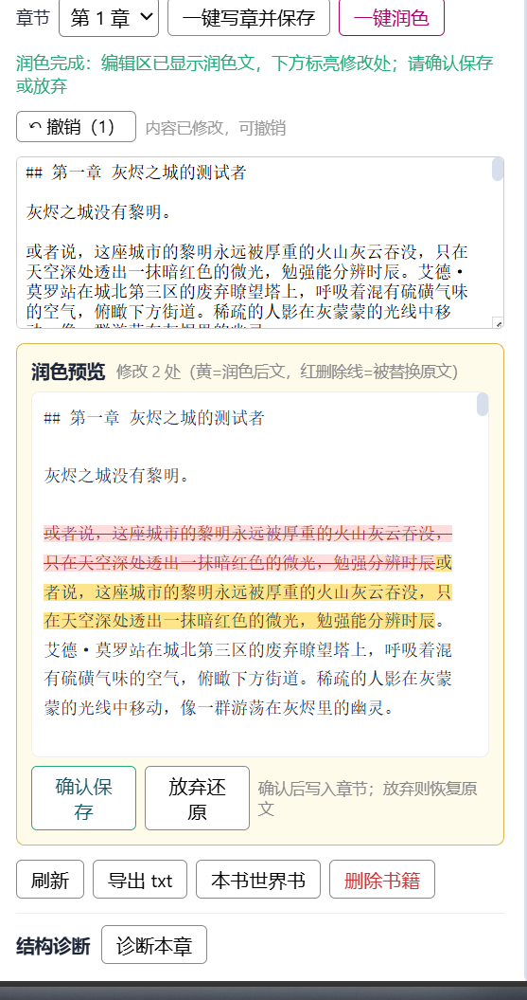

<p align="center">
  
</p>

# 虾说教材写作（dsh-course-writer）

一个面向 [DeepSeek Harness](https://deepseek-harness.github.io/deepseek-harness/guide/quickstart)（DSH）的网络课程创作插件：
**九阶段门禁式创作流程 + 资料库（lorebook）设定注入 + 本地课程导入 + AI 一键润色 + 去 AI 味 + 黄金三讲诊断 + 百万字一致性保障**。

- 中文 | [English](./README.en.md)

<p align="center">
  
</p>

让 DSH 像一位专业的课程编辑与你协同：从选题、设定、人设、大纲到分章、讲义、修订、结课，每一步有模板、有门禁、可校验、可回滚；并有资料库把你的设定固化下来，确保百万字不崩设定。

---

## ✨ 功能特性

### 九阶段门禁式创作流程
`选题 → 设定 → 人设 → 大纲 → 单元 → 教案 → 讲义 → 修订 → 结课`
- **阶段门禁**：未批准不能跳阶段（可用户显式放行/回退），杜绝模型"口头跳阶段"
- **产物版本快照**：每阶段每次提交留档 `versions/<phase>/v<n>`，可回退任意历史版本
- **审计日志**：每次 commit / 放行 / 回滚写入 `audit.jsonl`

### 资料库（lorebook）设定注入
- 关键词 / 正则触发 + 常驻注入，条目按书绑定（每本课程独立栏目）
- 导入支持 **Operit / SillyTavern / 角色卡** 三格式，自动兼容警告
- **导出到酒馆**：资料库面板点「**导出到酒馆**」直接下载 SillyTavern 原生 lorebook JSON（`{entries:[...]}`）即可在酒馆「Import」导入作前置设定；也可用 `lorebook_export_entries format=sillytavern` 走对话导出
- **AI 一键生成设定**：按课程名+题材自动生成 4-6 条核心设定并绑定本课程
- 注入 token 预算裁剪，长上下文不爆窗

<p align="center">
  
</p>

### 质量保障
- **AI 味检测与去除**：内置 234 词 5 类词库 + 密度评分 + 一键改写
- **黄金三讲诊断**：规则层离线必出分（钩子/开场/冲突/灌输/字数/对话）+ 可选模型层深度诊断
- **四族校验**：结构/内容/剧情/一致性，提交即检（字数/标题/禁用词/视角/钩子/教案覆盖/账本冲突）

### 百万字一致性
- **事实账本**：课时内 `<JSONPatch>` 自动落账（人物境界/物品/地点状态），冲突检测与巡检
- **时间线**：书内时间归一 + 倒挂检测；**伏笔**登记与回收跟踪；**资料库自动沉淀建议**
- **上下文包三层记忆**（L1 全书设定 + L2 卷章教案前文 + L3 摘要/变量/资料库）预算恒定（压测 100 万字 0 超限）

### 一键写作与润色
- **一键写教案**：host 直写（上下文包 → 讲义 → 自动落盘），课时统计/账本/审计联动；写作指令强调**严格遵循本章教案/全书设定/前文事实**，避免自创冲突
- **一键润色**：AI 做**重构式润色**——整句重写、大胆扩写、可在段后添加细节描写（只守情节/人物/设定底线），改动按**段落**拆成建议，每条可**单独采纳/拒绝**（也可全部采纳/全部拒绝），只保存你选中的改动
- **采纳即预览**：点「采纳这条」→ 顶部原文视图中该段**立即显示润色文并标绿**，新增段实时插入，取消采纳立即恢复——所见即所得
- **字级 diff 标亮**：每条建议段内标出具体改动（删除线=删，黄底=新增/改写处）
- **逐条可定位**：每条建议带「📍 定位」跳到原文对应段落
- **逐步撤销**：可撤销 AI 润色与手动编辑，还原到任意历史状态

<p align="center">
  
  
</p>

### 本地导入 & 配套工具
- **导入本地课程**：txt/md 自动识别课时并建书（含 md frontmatter 题材/课程名）
- **27 类题材**标签（玄幻/仙侠/武侠/西幻/都市/现实/科幻/悬疑/言情/轻课程/流派向…）
- **修订**（校对/节奏/文风三模式）、**导出**（txt/markdown/平台排版）
- **市场调研**辅助（web_search 引导 + 落盘 `reports/market.md`）、**模板复制**（克隆结课品为模板）、灵感库/伏笔/术语表/账本查询

### GUI 工作台 + 41 个 agent 工具
- 侧边栏「虾说教材写作」抽屉：项目列表 / 创建 / 详情 / 一键写教案 / 润色 / 诊断 / 导入 / 资料库管理
- 抽屉可展开、自动避让聊天框条；润色预览清晰展示
- 内置 60 个提示词模板（创作/文风 8 套/去味/润色/诊断/引导/资料库），`course_prompts` 可浏览渲染

<p align="center">
  
</p>

### 🎭 课程创作模式预设（agent 预设）
插件随包装载一个 **「虾说教材写作」agent 预设**，在 DSH 新建会话时的模式选择器里即可选用——选中即"一键进入创作模式"，不需要每次手动交代要写课程、要走流程。

**三通道协同，约束模型行为**：
1. **模式锚定（本预设）**——预设锚定创作 persona（名称为「虾说教材写作」，描述声明确创作的九阶段门禁方法），新建会话即进入目标模式；
2. **软引导（技能）**——随 enabling 自动注册的 `course-writing-workflow` 技能，进入会话后加载完整创作方法论（阶段定义、模板用法、工具写法、写作规范），即使你不用 GUI 也知道每一步该怎么做；
3. **硬轨道（工具）**——host 注册的 41 个 `course_*` / `lorebook_*` 工具随预设全程可调，阶段推进、产物提交、校验、写教案都必须走工具，防止模型"口头跳阶段"。

**为什么用预设**：
- **零初始化成本**：选它开新会话即锚定"资深课程作者"视角，直接开聊「创建项目，写本玄幻课程」就能跑通全流程；
- **不丢流程**：阶段门禁、资料库纪律、账本一致性这些硬约束靠工具与技能自动织入，你只需提出创作意图；
- **与 GUI 互补**：预设适合"对话驱动"创作（说一句写一章、给一段去 AI 味），GUI 工坊适合"可视化操作"（看项目列表、点按钮写教案/润色/导入），两者共用同一份项目数据与流程。

**使用方式**：新建会话 → 预设选择器选「虾说教材写作」→ 直接开始创作；或安装后自动同步到本地 `~/.dsh/.agent-presets/course-writer/`（升级插件自动更新）。

<p align="center">
  
</p>

---

## 🎯 使用场景

| 场景 | 怎么做 |
| --- | --- |
| 从零开一本新课程 | 打开工坊 → 输入课程名/选题材 → 或用「五步向导」逐步引导 |
| 已有结课/定好的设定 | 用「模板复制」克隆一本带完整设定骨架的新课程，直接开写讲义 |
| 想要热门题材方向 | 「市场调研」→ 引导 web_search 查榜单热词 → 落盘选题参考 |
| 把本地课程 txt/md 收进 DSH 续写 | 「导入本地课程」→ 自动建书分章 → 可直接继续润色/续写 |
| 保证不崩设定 | 资料库固化设定 + 账本巡检 + 一致性校验在写作时自动织入 |
| 写完投稿 | 「导出 txt」或 Markdown / 平台排版下载 |

---

## 📦 安装

> 需已装 DSH（跨 Windows/macOS/Linux；运行时 Node ≥18）。**务必安装最新版**（当前 v0.3.0）。

### ① 一句话让 AI 装（推荐）
把下面这段发给能执行命令的 AI：

> 帮我安装 DSH 插件「虾说教材写作」(dsh-course-writer)，**只装最新版**。步骤：从 `https://github.com/bettermen/dsh-course-writer/releases/latest` 下载最新的 `dsh-external-dsh-course-writer-*.tgz`（版本号最大的那个）→ 执行 `dsh plugin --profile web add <该 tgz 绝对路径>` → `dsh plugin list` 确认在列且已启用 → 提醒我刷新 DSH 页面（Ctrl+Shift+R）后侧边栏出现「虾说教材写作」。遇到报错先告诉我再处理。

### ② 手动下载装
从 https://github.com/bettermen/dsh-course-writer/releases/latest 下载最新的 `dsh-external-dsh-course-writer-*.tgz`，然后：

```bash
dsh plugin --profile web add <该文件路径>
dsh plugin list        # 看到 dsh-course-writer 即成功
```

### ③ 源码构建装（进阶）
需 Node ≥22 与 Git：

```bash
git clone https://github.com/bettermen/dsh-course-writer.git && cd dsh-course-writer
npm install && npm run verify && npm run build && npm pack
dsh plugin --profile web add ./dsh-external-dsh-course-writer-0.3.0.tgz
```
（Windows 用 Git Bash 跑构建脚本）

**装完**：侧边栏出现「虾说教材写作」、设置页出现同名卡片即完成；没有就刷新页面/重启 DSH 并在插件列表确认已启用。

### ✅ 三种方式装完后，确认「能用全部功能」

不论用哪种方式，装完都应看到👇，即可正常使用本项目所有功能：

- **侧边栏**出现「虾说教材写作」入口（工作台抽屉：项目/创建/写教案/润色/诊断/导入/资料库…）
- **设置 → 插件配置**出现「虾说教材写作」卡片（启用开关 + 数据目录，默认 `~/.dsh/dsh-course-writer`）
- **新会话**自动带出技能 `course-writing-workflow`（创作全流程指导）
- **新建会话的模式选择器**里可选中预设「虾说教材写作」（对话驱动创作）

> 💡 若某块没出现：先刷新页面；不行就重启 DSH，再在「设置 → 插件」里确认该插件「启用」开关是打开的。

--

### 装好后

- 侧边栏出现「**虾说教材写作**」入口（工作台抽屉）
- 设置 → 插件配置 → **虾说教材写作**（启用开关 + 数据目录）
- 新会话出现技能 `course-writing-workflow`（创作全流程方法）
- agent 预设「虾说教材写作」可选（新建会话模式选择器）

---

## 🚀 快速开始（3 分钟）

1. 打开侧边栏「虾说教材写作」→ 点「一键导入示例《青云问道》」（或输入课程名创建）
2. 进入项目详情 → 「一键写教案」→ 按上下文包自动出讲义 → 已存盘；不满意可「一键润色」
3. 或直接在对话里说：
   - 「创建项目，写本玄幻课程」
   - 「帮我写下一章」
   - 「把这段去 AI 味」「诊断一下开头」
   - 「克隆《青云问道》当模板」「调研下仙侠市场行情」
   - 「导入本地 txt」

数据目录默认 `~/.dsh/dsh-course-writer/`：

```
lorebook/       资料库（entries/groups/settings）
projects/      项目（book.json + docs/ + chapters/ + audit.jsonl + ledger.json + ...）
```

---

## 📖 功能使用指南

> 下面按功能逐个说明「在**界面哪里点** / 在**对话里怎么说**」，两种方式共用同一份数据与流程，随你习惯。

### 1️⃣ 创建一本课程（九阶段流程的起点）
- **界面**：打开「虾说教材写作」抽屉 → 顶部输入**课程名** → 选**题材**（27 种，按分组排列）→ 点「创建」。
- **对话**：「创建项目，写本玄幻课程」「新课程，仙侠」「开本都市文」。
- 创建后进入项目详情，看到当前阶段（初始为 `topic` 选题）与各阶段状态。

> 也可以先点「**一键导入示例《青云问道》**」，一步得到一本带资料库条目的示例书，边看边学。

### 2️⃣ 走完九阶段（选题→…→结课）
- 阶段链：`选题 → 设定 → 人设 → 大纲 → 单元 → 教案 → 讲义 → 修订 → 结课`，**前一阶段未批准不能进入下一阶段**（门禁）。
- **怎么推进**：
  - **对话**：说「生成世界观设定」「设计人设」「写全书大纲」，模型会用相应模板产出该阶段文档；完成后说「提交设定」走 `course_commit` → 校验通过即批准解锁下一阶段。
  - **界面**：目前阶段推进主要通过对话里的 agent 工具完成（`course_phase` / `course_commit`），舞台右上角会显示当前阶段与门禁状态。
- 产物自动存 `docs/<阶段>.md` + 留历史版本（`versions/<阶段>/v<N>`），随时可回退。

### 3️⃣ 写讲义（一键写教案）
- **界面**：项目详情 → 选**课时号** → 点「**一键写教案并保存**」→ 模型按「全书设定＋本卷/本章教案＋前文＋资料库命中等」的上下文包自动写一章 → **已自动存盘**，统计/账本/审计联动。
- **对话**：「帮我写下一章」「写第 5 章」「继续写」。
- 写好后左侧编辑框/B 面板可看到讲义与字数（达标徽标）。不满意就点「一键润色」或手动改。

### 4️⃣ 润色与撤销
- **一键润色**：点「**一键润色**」→ 模型**重构式润色**（整句重写/大胆扩写/可新增细节段，只守情节人物底线）→ 改动按**段落**列成建议，每条可**单独采纳/拒绝**，顶部**原文视图会随采纳/撤销实时变化**（采纳的段变绿显示润色文、新增段实时插入）→ 「确认保存」按你采纳的改动写入课时，或「放弃还原」恢复原文。
- **撤销**：编辑区上方「↶ 撤销（N）」按钮。手动编辑、写教案回填、润色应用都会记录历史，可**连续点击逐步还原**到任意之前的状态。

### 5️⃣ 建资料库（固化设定，不崩设定）
- **入口**：项目详情右下「**本课程资料库**」，或抽屉列表里课程行的「资料库」按钮。
- **AI 一键生成**：资料库面板先在上方「栏目」下拉选一本课程 → 点「**AI 一键生成设定**」→ 按课程名+题材自动生成 4-6 条核心设定（世界观/主角/宗门/境界等）并绑定本课程。
- **手动**：点「+ 新建条目」→ 填名称/内容/触发关键词（逗号分隔）/是否常驻/优先级，并「绑定到本课程」。
- **导入已有设定**：`lorebook_import_entries`（Operit / SillyTavern / 角色卡格式，可直接发文件）。
- **导出到酒馆**：资料库面板点「**导出到酒馆**」→ 下载 `novel-lorebook-export.json` → 在 SillyTavern「Import」导入即可当前置设定（也可对话 `lorebook_export_entries format=sillytavern`）。
- 写作时命中的条目会自动注入上下文包（每书独立栏目，`Lorebook`）。

### 6️⃣ 导入本地课程
- **界面**：项目列表「**导入本地课程**」→ 选一个本地 `.txt` / `.md` 课程文件 → 自动识别课时标题（含"第一章/楔子/番外"等）并建书 → 全部讲义按章同步，可直接续写/润色。
- **对话**：「导入本地 txt」。

### 7️⃣ 质量体检（诊断 / 去 AI 味 / 校验）
- **结构诊断**：项目详情底部「**结构诊断**」→「诊断本章」→ 得分与问题（钩子/开场/冲突/灌输/字数/对话）。
- **去 AI 味**：对话「把这段去 AI 味」→ `course_depolish` 检测并改写（内置 234 词 5 类词库）。
- **四族校验**：提交时自动跑结构/内容/剧情/一致性；也可对话「校验这章」手动触发 `course_validate`。

### 8️⃣ 保持一致性（长文不崩设定）
- **事实账本**：课时内 `<JSONPatch>` 自动落账（人物境界/物品/地点状态）。
- **巡检**：对话「跑一遍一致性巡检」→ `course_consistency_audit` 查账本冲突、时间线倒挂、伏笔超期，并给出资料库沉淀建议。
- **查账本**：「林远现在什么境界」「查一下账本」→ `course_ledger`。
- **伏笔/时间线**：对话「登记个伏笔，第 3 章埋，第 20 章回收」「记录第 5 章书内时间『第三日』」→ `course_foreshadow` / `course_timeline`。

### 9️⃣ 修订与导出
- **修订**：对话「修订第 3 章，校错别字」→ `course_revise`（校对/节奏/文风三模式，产出**新版本不覆盖原稿**）。
- **导出**：界面项目详情「**导出 txt**」（带 BOM，可直接投稿）；对话「导出成稿」→ `course_export`（txt / markdown / 平台排版）。

### 🔟 市场调研 & 模板复制
- **市场调研**（选题用）：对话「调研下仙侠的市场行情」→ `course_market_research` **mode=prompt** 给你一组 `web_search` 检索词 → 模型检索后以 **mode=report** 把榜单热词/读者偏好/同类卖点落盘 `reports/market.md` → 选题报告里引用。
- **模板复制**（克隆设定骨架）：对话「以《青云问道》为模板开本新课程」→ `course_clone_project` 复制**字数目标/风格/禁用词 + 已完成的阶段设定文档**（选题/设定/人设/大纲/单元/教案），**讲义不复制**，状态机重置——直接对着现成设定写讲义。

### 1️⃣1️⃣ 灵感 / 术语表
- 对话「记个灵感：雨夜剑冢」「建个术语表：玄天宗——地域宗门」→ `course_idea` / `course_glossary`（选题拉取聚合、术语注入防用词漂移）。

### 1️⃣2️⃣ 用「创作模式预设」开新会话
- 新建会话 → 预设选择器选「**虾说教材写作**」→ 直接对话「创建项目，写本玄幻课程」即进入创作模式（persona + 技能方法 + 41 个工具自动就位）。

> 💡 **提示**：几乎每个功能都有对应的 `course_*` 工具，模型在创作模式下会自己调用并提示你确认（写操作）。你不必记命令，**用大白话提需求即可**；想知道有哪些能力，对话里说「课程工坊能做什么」。

---

## ⚙️ 配置

| 设置 | 默认 | 说明 |
| --- | --- | --- |
| enabled | true | 插件总开关（关闭即注销工具/技能，数据保留） |
| dataDir | `~/.dsh/dsh-course-writer` | 数据根目录 |
| uiHidden | false | 隐藏侧边栏「虾说教材写作」入口（存于浏览器本地，任何环境可用；即时生效） |

项目级（创建时/模板复制保留）：**27 题材**、每章字数目标（默认 2000-4000）、风格（视角/禁用词/AI 味词）、阶段门禁开关。

---

## 🔌 与 DSH 的交互

- **41 个 agent 工具**：`course_*`（项目/阶段/写教案/校验/诊断/去味/巡检/账本/克隆/导出/市场调研…）+ `lorebook_*`（资料库 CRUD）+ `course_prompts`（提示词库）
- **两段式写教案协议**：`course_write_chapter` 返回上下文包 → 模型输出讲义 → `course_commit_chapter` 落盘（统计/账本/审计）
- **技能**：`course-writing-workflow`（流程纪律与方法指导）
- **GUI 数据面**：`/api/course-writer/*`（项目/课时/上下文/诊断/润色/导入，fence 头校验）

---

## ❓ 常见问题（FAQ）

**Q：为什么要先发起一次对话才能写教案/润色？**
A：本插件复用你的主模型路由（`llm/stream` 捕获），不持有独立密钥。首次请先在会话里发一句话让模型路由就绪。

**Q：导入的书讲义会丢吗？**
A：不会。txt/md 按课时标题自动切分（含粘连标题、楔子/番外等），无法识别的按段落分块，内容完整同步。

**Q：润色/写教案会覆盖我的原稿吗？**
A：一键写教案自动落盘（可撤销）；一键润色先预览 diff，确认才保存，放弃可还原原文。

**Q：资料库 AI 生成的内容安全吗？**
A：生成后是「待确认」的条目，写入前你可编辑/删除；注入时按书隔离。

---

## 🧪 开发

```bash
npm run typecheck   # host + client 双段
npm test            # vitest（291 例）
npm run build       # tsc host + tsdown client
node scripts/simulate-1m.mjs   # 百万字一致性压测
```

模块开发纪律：每模块 → 单测 → 复盘（见 [docs/MODULE-LOG.md](./docs/MODULE-LOG.md)）。

---

## 🛡 安全模型

- 数据仅存本地 `~/.dsh/dsh-course-writer/`，不联网上传
- 所有写操作走审计日志；LLM 辅助调用复用主模型路由，无独立密钥
- GUI 路由带自定义头校验（防 CSRF/dns-rebinding）；未启用返回 503
- 市场调研仅在你显式调用工具时触发搜索（复用会话 web_search）

## 📄 许可

MIT
