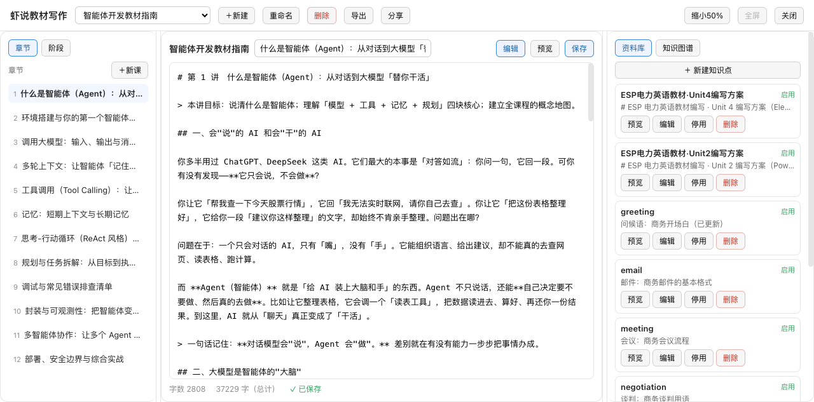

<p align="center">
  
</p>

# 虾说教材写作（dsh-course-writer）

一个面向 [DeepSeek Harness](https://deepseek-harness.github.io/deepseek-harness/guide/quickstart)（DSH）的 **AI 教材写作工作台**插件：
**三栏式界面 + 九阶段门禁式编写流程 + 课程/章节/资料库管理 + 导出（TXT/Word）+ 分享协作**。

- 中文 | [English](./README.en.md)

<p align="center">
  
</p>

让 DSH 像一位专业的教材编写专家与你协同：从选题、学情分析、教学目标到教案、课件练习、评估结课，每一步有方法、有门禁、可校验、可导出，并配有资料库与知识图谱把知识点结构固化下来。

---

## ✨ 功能特性

### 三栏式工作台
- **左栏**：章节列表 + 九阶段门禁导航（进度 x/9、阶段锁定/进行中/已通过状态）
- **中栏**：Markdown 编辑 + 分屏预览 + 章节名编辑 + 手动保存 / 自动保存（停止输入 2 秒自动落盘）
- **右栏**：资料库（知识点管理）/ 知识图谱（可视化知识结构）

### 课程管理
- **新建课程**：23 类课程类型下拉选择（通识素养 / 学科知识 / 职业技能 / 资格考试 / 兴趣拓展）
- **重命名 / 删除**：一键操作，删除二次确认

### 资料库（知识点管理）
- 知识点**新增 / 编辑 / 停用 / 启用 / 删除 / 预览**（弹窗表单，含名称、内容、关键词）
- 关键词逗号分隔，按课程隔离（每门课独立栏目）

### 知识图谱
- 可视化课程知识点与关联关系
- 节点标签沿圆周径向分布，防重叠；长标签截断 + 悬停查看完整

### 导出
- **TXT** 文本导出
- **Word（.docx）** 标准 Office 格式（标题层级 + 章节样式）

### 分享协作
- 生成**只读 / 可编辑**分享链接，他人免登录即可访问
- 可编辑协作带**版本记录**与**冲突检测**（多人编辑冲突时提示覆盖或加载最新）

### 九阶段门禁式编写流程
`选题 → 学情分析 → 教学目标 → 大纲 → 单元 → 教案 → 课件练习 → 评估结课`
- **阶段门禁**：前一阶段未批准不能进入下一阶段
- **产物版本快照**：每次提交留档，可回退
- **审计日志**：每次操作写入 audit.jsonl

### 窗口控制
- 全屏 / 缩小 50%（可拖拽调整大小）/ 关闭
- 三栏宽度可拖拽调整

<p align="center">
  
</p>

### 🎭 教材写作模式预设（agent 预设）
插件随包装载一个 **「虾说教材写作」agent 预设**，在 DSH 新建会话时的模式选择器里即可选用——选中即"一键进入教材编写模式"。

**三通道协同，约束模型行为**：
1. **模式锚定（本预设）**——预设锚定"教材编写专家" persona；
2. **软引导（技能）**——随 enabling 自动注册的 `course-writing-workflow` 技能，进入会话后加载完整编写方法论（九阶段定义、模板用法、工具写法）；
3. **硬轨道（工具）**——host 注册的 `course_*` / `lorebook_*` 工具随预设全程可调，阶段推进、产物提交、校验、写教案都走工具。

**使用方式**：新建会话 → 预设选择器选「虾说教材写作」→ 直接开始创作；或安装后自动同步到本地 `~/.dsh/.agent-presets/course-writer/`。

---

## 🎯 使用场景

| 场景 | 怎么做 |
| --- | --- |
| 从零写一门新教材 | 打开工坊 → 「＋新建」→ 选课程类型 → 逐章编写 |
| 已有大纲/知识点 | 建好课程后，把知识点录入资料库，正文引用 |
| 团队协作编教材 | 「分享」生成可编辑链接，多人协作 + 冲突检测 |
| 交付 Word 文档 | 「导出」→ Word(.docx) 一键下载 |
| 查看知识结构 | 右栏「知识图谱」可视化知识点关联 |

---

## 📦 安装

> 需已装 DSH（跨 Windows/macOS/Linux；运行时 Node ≥18）。**务必安装最新版**（当前 v0.3.0）。

### ① 一句话让 AI 装（推荐）
把下面这段发给能执行命令的 AI：

> 帮我安装 DSH 插件「虾说教材写作」(dsh-course-writer)，**只装最新版**。步骤：从 `https://github.com/bettermen/dsh-course-writer/releases/latest` 下载最新的 `dsh-external-dsh-course-writer-*.tgz`（版本号最大的那个）→ 执行 `dsh plugin --profile web add <该 tgz 绝对路径>` → `dsh plugin list` 确认在列且已启用 → 提醒我刷新 DSH 页面（Ctrl+Shift+R）后侧边栏出现「虾说教材写作」。遇到报错先告诉我再处理。

### ② 手动下载装
从 https://github.com/bettermen/dsh-course-writer/releases/latest 下载最新的 `dsh-external-dsh-course-writer-*.tgz`，然后：

```bash
dsh plugin --profile web add <该文件路径>
dsh plugin list        # 看到 dsh-course-writer 即成功
```

### ③ 源码构建装（进阶）
需 Node ≥22 与 Git：

```bash
git clone https://github.com/bettermen/dsh-course-writer.git && cd dsh-course-writer
npm install && npm run build && npm pack
dsh plugin --profile web add ./dsh-external-dsh-course-writer-0.3.0.tgz
```

**装完**：侧边栏出现「虾说教材写作」、设置页出现同名卡片即完成；没有就刷新页面/重启 DSH 并在插件列表确认已启用。

---

## 🚀 快速开始

1. 打开侧边栏「虾说教材写作」→ 点「＋新建」→ 输入课程名 + 选课程类型
2. 左栏点章节切换，中栏写正文（Markdown），停止输入 2 秒自动保存
3. 右栏「资料库」录入知识点（含关键词），「知识图谱」查看知识结构
4. 顶部「导出」→ 选 TXT 或 Word 下载；「分享」→ 生成协作链接

数据目录默认 `~/.dsh/dsh-course-writer/`：

```
lorebook/       资料库（entries）
projects/      项目（book.json + chapters/ + audit.jsonl + ...）
```

---

## 📖 功能使用指南

### 1️⃣ 新建课程
- 顶部「＋新建」→ 弹窗输入课程名 + 下拉选课程类型（23 类分组）→ 创建

### 2️⃣ 编写章节
- 左栏章节列表点击切换章节；中栏编辑正文（Markdown）
- 章节名可自定义（顶部输入框）
- 保存：手动点「保存」，或停止输入 2 秒自动保存（底部显示「● 未保存 / ✓ 已保存」）

### 3️⃣ 资料库（知识点）
- 右栏「资料库」Tab → 「＋ 新建知识点」→ 填名称 / 内容 / 关键词（逗号分隔）
- 每条知识点支持**预览 / 编辑 / 停用启用 / 删除**
- 知识点按课程隔离

### 4️⃣ 知识图谱
- 右栏「知识图谱」Tab → 可视化当前课程知识点关联
- 节点标签防重叠，悬停查看完整名称

### 5️⃣ 导出
- 顶部「导出」→ 选 **TXT** 或 **Word(.docx)** → 直接下载

### 6️⃣ 分享协作
- 顶部「分享」→ 选权限（只读 / 可编辑）→ 生成链接 → 复制发给他人
- 可编辑协作：保存时带版本号，多人冲突时提示「覆盖 or 加载最新」
- 可撤销任意分享链接

---

## ⚙️ 配置

| 设置 | 默认 | 说明 |
| --- | --- | --- |
| enabled | true | 插件总开关（关闭即注销工具/技能，数据保留） |
| dataDir | `~/.dsh/dsh-course-writer` | 数据根目录 |
| uiHidden | false | 隐藏侧边栏「虾说教材写作」入口 |

---

## 🔌 与 DSH 的交互

- **agent 工具**：`course_*`（项目/阶段/写教案/校验/导出…）+ `lorebook_*`（资料库 CRUD）
- **技能**：`course-writing-workflow`（九阶段编写方法指导）
- **GUI 数据面**：`/api/course-writer/*`（项目/章节/导出/分享/资料库，fence 头校验）

---

## ❓ 常见问题（FAQ）

**Q：为什么保存后没有跳回第 1 课？**
A：这是刻意设计——保存后停留当前章节，只刷新章节列表，方便连续编写。

**Q：编辑后切章节会丢内容吗？**
A：不会。有未保存改动时切章节/切课程/关闭都会先弹确认，避免误丢。

**Q：分享链接安全吗？**
A：分享走独立 `/share/` 公开路径 + token 鉴权，不暴露管理密码；可随时撤销。

**Q：Word 导出是标准格式吗？**
A：是标准 `.docx`（零依赖生成器），Word / WPS / Google Docs 均可打开，保留标题与章节层级。

---

## 🧪 开发

```bash
npm run typecheck   # host + client 双段
npm test            # vitest
npm run build       # tsc host + tsdown client
npm pack            # 打包为 tgz
```

---

## 🛡 安全模型

- 数据仅存本地 `~/.dsh/dsh-course-writer/`，不联网上传
- 所有写操作走审计日志
- GUI 路由带自定义头校验（防 CSRF/dns-rebinding）
- 分享接口 token 鉴权 + nginx 独立放行，不暴露管理凭据

## 📄 许可

MIT
